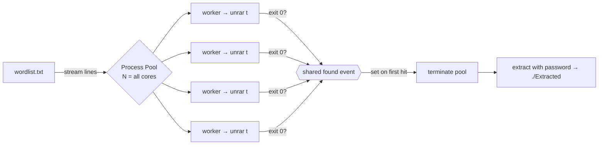

<div align="center">

# 🥷 RARNinja

### Fast, multi-core RAR password recovery — native on Apple Silicon

A dependency-free dictionary attack that saturates every CPU core and stops the
instant it finds the password.


### [⬇︎ Download the macOS app](https://github.com/G3nnius/crack-rar-password/releases/latest)

No Python, no setup — grab `RARNinja-macos-arm64.zip` from the latest release,
unzip, and open. (First launch: right-click the app → **Open**, since it isn't
notarized. See [Troubleshooting](#troubleshooting).)

</div>

---

```
   ██▀███   ▄▄▄       ██▀███   ███▄    █  ██▓ ███▄    █  ▄▄▄██▀▀▀▄▄▄
  ▓██ ▒ ██▒▒████▄    ▓██ ▒ ██▒ ██ ▀█   █ ▓██▒ ██ ▀█   █    ▒██  ▒████▄
  ▓██ ░▄█ ▒▒██  ▀█▄  ▓██ ░▄█ ▒▓██  ▀█ ██▒▒██▒▓██  ▀█ ██▒   ░██  ▒██  ▀█▄
  ▒██▀▀█▄  ░██▄▄▄▄██ ▒██▀▀█▄  ▓██▒  ▐▌██▒░██░▓██▒  ▐▌██▒▓██▄██▓ ░██▄▄▄▄██
  ░██▓ ▒██▒ ▓█   ▓██▒░██▓ ▒██▒▒██░   ▓██░░██░▒██░   ▓██░ ▓███▒   ▓█   ▓██▒
  ░ ▒▓ ░▒▓░ ▒▒   ▓▒█░░ ▒▓ ░▒▓░░ ▒░   ▒ ▒ ░▓  ░ ▒░   ▒ ▒  ▒▓▒▒░   ▒▒   ▓▒█░
             || RARNinja: The RAR Password Cracking Utility ||
```

## Table of Contents

- [Download](#download)
- [Why this fork](#why-this-fork)
- [Features](#features)
- [How it works](#how-it-works)
- [Requirements](#requirements)
- [Installation](#installation)
- [Usage](#usage)
- [Desktop app (GUI)](#desktop-app-gui)
- [Options](#options)
- [Examples](#examples)
- [Performance](#performance)
- [Compiled binary](#compiled-binary-macos-arm64)
- [Testing](#testing)
- [Project structure](#project-structure)
- [Troubleshooting](#troubleshooting)
- [Responsible use](#responsible-use)
- [Credits](#credits)

## Download

**Easiest — the desktop app:** download `RARNinja-macos-arm64.zip` from the
[latest release](https://github.com/G3nnius/crack-rar-password/releases/latest),
unzip, and double-click `RARNinja.app`. It bundles everything (including the
`unrar` backend) — no Python required.

**Terminal fan?** The same release ships a standalone CLI binary, `rarninja`.

> First launch is blocked by Gatekeeper because the app isn't notarized.
> Right-click the app and choose **Open** once (then it's trusted), or run
> `xattr -dr com.apple.quarantine RARNinja.app`.

## Why this fork

The upstream project only ran on Windows — it hardcoded `UnRAR.exe` — and its
"multithreaded" mode never stopped its worker threads once a password was found.
This fork is a ground-up rewrite focused on **running natively on macOS (Apple
Silicon)** and using the machine to its full potential.

| | Upstream | This fork |
|---|---|---|
| Backend | `UnRAR.exe` (Windows only) | Auto-detected native `unrar` / `7zz` / `7z` |
| Parallelism | 8 fixed threads, **no early stop** | Process pool across **all cores** + shared early-stop |
| Per guess | Extracts the whole archive | Tests only (no disk writes) until the hit |
| Wordlist | Loaded fully into RAM | Streamed line by line |
| Dependencies | `rarfile`, `colorama`, `termcolor` | **None** (standard library) |
| Interface | Interactive prompts only | CLI **and** interactive |
| Distribution | Scripts | Optional self-contained arm64 binary |

## Features

- 🖥️ **Native macOS desktop app** — a light Tk GUI: pick an archive, pick a wordlist, click Start.
- ⚡ **All-core process pool** — one worker per logical CPU by default.
- 🛑 **Instant early-stop** — a shared event halts every worker the moment one succeeds.
- 🔍 **Test, don't extract** — each candidate is verified with `unrar t`; only the winning password triggers a real extraction.
- 🧱 **Backend auto-detection** — prefers the bundled arm64 `unrar`, then `unrar`, `7zz`, or `7z` on your `PATH`.
- 🪶 **Zero dependencies** — pure Python standard library.
- 📦 **Streamed wordlist** — constant memory, even for multi-GB dictionaries.
- 🧪 **Tested** — ships with a self-check suite and an encrypted fixture.
- 🛠️ **Compilable** — build a single optimized arm64 executable that needs no Python.

## How it works

Instead of the upstream "chunk the list into 8 pieces" trick, RARNinja feeds the
wordlist to a pool of worker processes. Each worker spawns the RAR backend in
*test* mode (which decrypts and CRC-checks without writing files). The first
worker to get exit code `0` sets a shared flag; the pool is torn down and only
then is the archive actually extracted.



## Requirements

- **Python 3.8+** (uses only the standard library), *or* the [compiled binary](#compiled-binary-macos-arm64) which needs nothing.
- A **RAR backend**. This repo bundles RARLAB `unrar` 7.12 for Apple Silicon in
  [`bin/`](bin), so on an M-series Mac you need nothing else. On other systems,
  install any of `unrar`, `7zz`, or `7z`.

## Installation

```bash
git clone https://github.com/G3nnius/crack-rar-password.git
cd crack-rar-password
```

Getting a backend on non-macOS-arm systems:

```bash
# macOS (Homebrew) — 7-Zip provides 7zz, which handles RAR5
brew install sevenzip

# Debian / Ubuntu
sudo apt install unrar        # or: sudo apt install p7zip-full

# Arch
sudo pacman -S unrar
```

## Usage

**Scriptable** (recommended):

```bash
python3 RARNinja.py <archive.rar> <wordlist.txt>
```

**Interactive** — run with no arguments and it prompts for the paths:

```bash
python3 RARNinja.py
```

On success the archive is extracted into `./Extracted/`.

## Desktop app (GUI)

Prefer buttons to flags? Launch the app (or run `python3 gui.py` from source):

1. **Select Archive…** — choose the encrypted `.rar`.
2. **Select Wordlist…** — choose your dictionary file.
3. Adjust **Workers** if you like (defaults to every core) and toggle
   **Extract on success**.
4. Hit **Start Cracking**. Live progress shows tries and rate; **Stop** cancels
   at any time. On success the password is shown and the archive is extracted to
   an `Extracted/` folder next to it.

The GUI is pure standard-library `tkinter` — no extra dependencies — and runs the
same all-core engine as the CLI on a background thread, so the window stays
responsive.

## Options

```
positional:
  rar                  path to the .rar file
  wordlist             path to the dictionary file

options:
  -w, --workers N      parallel workers            (default: all CPU cores)
  -t, --tool PATH      force a backend             (unrar / 7zz / 7z or a full path)
  --extract-dir DIR    extraction target on success(default: ./Extracted)
  --no-extract         report the password only, skip extraction
  -q, --quiet          suppress the live progress line
  -h, --help           show help
```

## Examples

```bash
# Full send: all cores, extract on success
python3 RARNinja.py secret.rar rockyou.txt

# Just find the password, don't extract, stay quiet (good for scripts)
python3 RARNinja.py secret.rar rockyou.txt --no-extract -q

# Pin to 4 workers and a specific backend
python3 RARNinja.py secret.rar rockyou.txt -w 4 -t 7zz

# Extract somewhere else
python3 RARNinja.py secret.rar words.txt --extract-dir ~/loot
```

Sample run:

```
Backend: bin/unrar  (unrar)   Workers: 11
Working...
  PASSWORD FOUND: hunter2
  1,842 tries in 5.87s  (~314/sec)
  Extracted to: /path/to/Extracted
```

## Performance

Each guess runs the backend's RAR5 key-derivation once, so throughput is bounded
by the crypto, not by RARNinja. Measured on an 11-core Apple M-series
(5 performance + 6 efficiency cores), worst case (full wordlist exhaustion):

| Workers | Throughput | Speed-up |
|--------:|-----------:|---------:|
| 1       | ~58 tries/sec  | 1.0× |
| 5       | ~238 tries/sec | 4.1× |
| 11      | ~315 tries/sec | 5.4× |

Scaling flattens past the performance-core count because RAR5's key-derivation
is intentionally CPU-heavy.

> [!TIP]
> For very large wordlists, a GPU/CPU hash cracker is far faster. Extract the
> hash with `rar2john your.rar > hash.txt` and run
> [John the Ripper](https://www.openwall.com/john/) or
> [hashcat](https://hashcat.net/hashcat/) (mode `13000` for RAR5). RARNinja
> trades that peak speed for zero dependencies and a two-argument workflow.

## Compiled binary (macOS arm64)

One script builds everything — self-contained, optimized, and needing no Python:

```bash
./scripts/build.sh
```

Produces:

| Artifact | What it is |
|---|---|
| `dist/app/RARNinja.app` | the desktop GUI application |
| `dist/RARNinja-macos-arm64.zip` | that app, zipped for a release |
| `dist/rarninja` | the standalone CLI binary |

The script spins up a throwaway virtualenv, installs PyInstaller, and produces
`--optimize 2`, arm64 builds with `unrar` bundled inside each.

## Testing

```bash
python3 tests/test_rarninja.py
```

The suite cracks a committed, header-encrypted fixture
(`tests/fixtures/locked.rar`, password `hunter2`) and verifies the not-found and
extraction paths.

## Project structure

```
.
├── RARNinja.py            # the engine + CLI (single file, stdlib only)
├── gui.py                 # the desktop GUI (tkinter, stdlib only)
├── bin/
│   ├── unrar              # RARLAB unrar 7.12, arm64 (bundled backend)
│   ├── rar                # RARLAB rar 7.12, arm64 (used to build fixtures)
│   └── RARLAB-license.txt
├── scripts/
│   └── build.sh           # compile the standalone arm64 binary
├── tests/
│   ├── test_rarninja.py
│   └── fixtures/          # locked.rar + words.txt
├── requirements.txt       # (no runtime deps; pyinstaller optional for builds)
└── README.md
```

## Troubleshooting

- **"No RAR backend found."** Install `unrar`, `7zz`, or `7z`, or pass one with
  `-t /path/to/tool`. On Apple Silicon the bundled `bin/unrar` is used
  automatically.
- **macOS blocks `bin/unrar` ("cannot be opened")** — Gatekeeper quarantine.
  Clear it once with `xattr -dr com.apple.quarantine bin/unrar`.
- **Password with non-ASCII / odd bytes** — wordlists are read with
  `surrogateescape`, so arbitrary byte passwords round-trip correctly on
  Linux/macOS.

## Responsible use

RARNinja is a password-**recovery** tool. Use it only on archives you own or are
explicitly authorized to access. You are responsible for complying with the laws
and terms that apply to you. Do not use it to access data without permission.

## Credits

- Original **RARNinja** by [SHUR1K-N](https://github.com/SHUR1K-N) — https://TheComputerNoob.com
- Bundled `unrar` / `rar` © RARLAB (Alexander Roshal); see `bin/RARLAB-license.txt`.
- Native rewrite, all-core engine, tests, and arm64 build in this fork.
