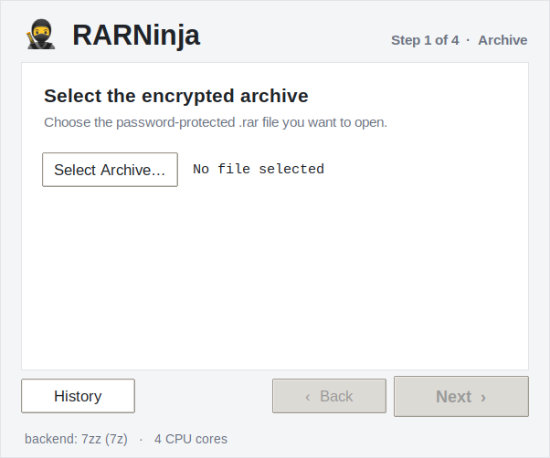
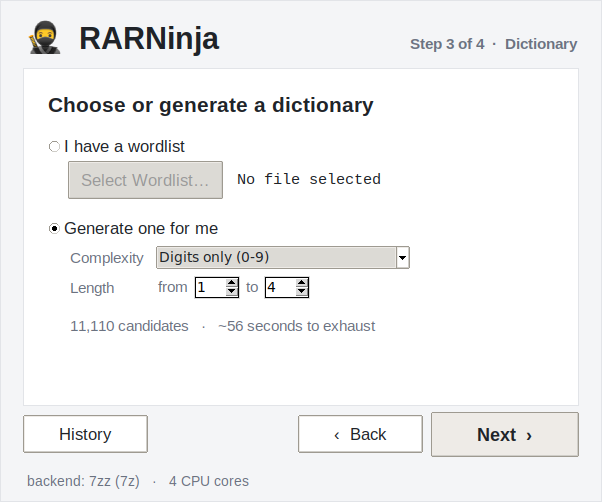
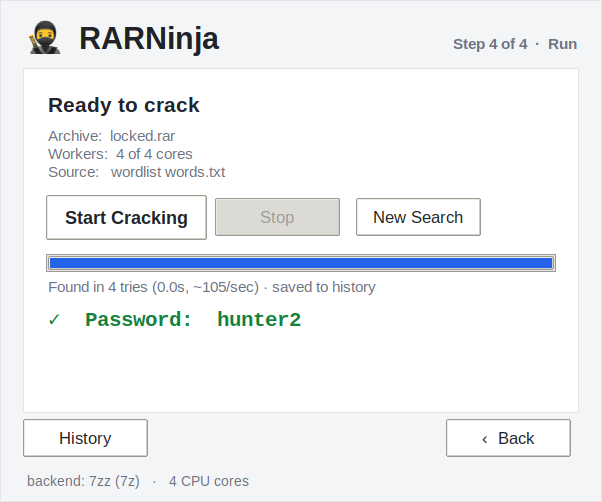
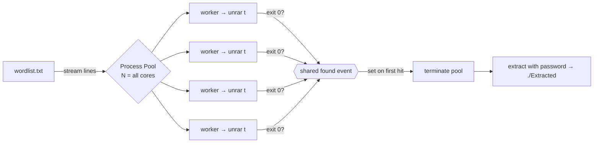

<div align="center">

# 🥷 RARNinja

### Fast, multi-core RAR password recovery — native on Apple Silicon

A dependency-free dictionary attack that saturates every CPU core and stops the
instant it finds the password.


### [⬇︎ Download the macOS app](https://github.com/G3nnius/crack-rar-password/releases/latest)

No Python, no setup — grab `RARNinja-macos-arm64.zip` from the latest release,
unzip, and open. (First launch: right-click the app → **Open**, since it isn't
notarized. See [Troubleshooting](#troubleshooting).)

</div>

---

```
   ██▀███   ▄▄▄       ██▀███   ███▄    █  ██▓ ███▄    █  ▄▄▄██▀▀▀▄▄▄
  ▓██ ▒ ██▒▒████▄    ▓██ ▒ ██▒ ██ ▀█   █ ▓██▒ ██ ▀█   █    ▒██  ▒████▄
  ▓██ ░▄█ ▒▒██  ▀█▄  ▓██ ░▄█ ▒▓██  ▀█ ██▒▒██▒▓██  ▀█ ██▒   ░██  ▒██  ▀█▄
  ▒██▀▀█▄  ░██▄▄▄▄██ ▒██▀▀█▄  ▓██▒  ▐▌██▒░██░▓██▒  ▐▌██▒▓██▄██▓ ░██▄▄▄▄██
  ░██▓ ▒██▒ ▓█   ▓██▒░██▓ ▒██▒▒██░   ▓██░░██░▒██░   ▓██░ ▓███▒   ▓█   ▓██▒
  ░ ▒▓ ░▒▓░ ▒▒   ▓▒█░░ ▒▓ ░▒▓░░ ▒░   ▒ ▒ ░▓  ░ ▒░   ▒ ▒  ▒▓▒▒░   ▒▒   ▓▒█░
             || RARNinja: The RAR Password Cracking Utility ||
```

## Screenshots

<div align="center">

| Select the archive | Generate a dictionary | Cracked & saved |
|:--:|:--:|:--:|
|  |  |  |

</div>

## Table of Contents

- [Screenshots](#screenshots)
- [Download](#download)
- [First run](#first-run)
- [Why this fork](#why-this-fork)
- [Features](#features)
- [How it works](#how-it-works)
- [Requirements](#requirements)
- [Installation](#installation)
- [Usage](#usage)
- [Desktop app (GUI)](#desktop-app-gui)
- [Options](#options)
- [Examples](#examples)
- [Performance](#performance)
- [Compiled binary](#compiled-binary-macos-arm64)
- [Testing](#testing)
- [Project structure](#project-structure)
- [Troubleshooting](#troubleshooting)
- [Responsible use](#responsible-use)
- [Credits](#credits)

## Download

Grab a build from the
[latest release](https://github.com/G3nnius/crack-rar-password/releases/latest).
Every artifact is self-contained — the RAR backend is bundled inside, so there
is nothing else to install.

| Platform | Asset | What you get |
|---|---|---|
| macOS (Apple Silicon) | `RARNinja-macos-arm64.zip` | the **desktop app** (GUI) |
| macOS (Apple Silicon) | `rarninja-macos-arm64` | CLI binary |
| Linux x86-64 | `rarninja-gui-linux-x64` | **desktop app** (GUI) |
| Linux x86-64 | `rarninja-linux-x64` | CLI binary |
| Linux arm64 | `rarninja-gui-linux-arm64` | **desktop app** (GUI) |
| Linux arm64 | `rarninja-linux-arm64` | CLI binary |

**macOS app:** unzip, then for the first launch right-click **`Start RARNinja.command`**
→ **Open** (it clears Gatekeeper's quarantine and opens the app). After that,
`RARNinja.app` opens on a normal double-click. See [First run](#first-run).

**Linux app (GUI):** `chmod +x rarninja-gui-linux-*` then run it (needs a
desktop session / X11 — most file managers also let you double-click it). The
`rarninja-linux-*` files are the terminal CLI equivalent.

> Builds are produced by GitHub Actions on native runners
> ([`.github/workflows/release.yml`](.github/workflows/release.yml)); pushing a
> `v*` tag cuts a new release with all four assets.

## First run

**macOS.** The app isn't code-signed by Apple, so the first launch needs one
click. The download unzips to a `RARNinja` folder containing the app plus a
helper:

- **Easiest:** right-click **`Start RARNinja.command`** → **Open** → **Open**.
  It clears the quarantine flag and launches the app; do this once, then open
  `RARNinja.app` normally.
- **Or in Terminal:**
  ```bash
  xattr -dr com.apple.quarantine RARNinja.app && open RARNinja.app
  ```

**Linux.** Make it executable and run it (needs a desktop session / X11):
```bash
chmod +x rarninja-gui-linux-x64   # or rarninja-gui-linux-arm64
./rarninja-gui-linux-x64
```

Every download also includes a `FIRST-RUN.txt` with these steps.

## Why this fork

The upstream project only ran on Windows — it hardcoded `UnRAR.exe` — and its
"multithreaded" mode never stopped its worker threads once a password was found.
This fork is a ground-up rewrite focused on **running natively on macOS (Apple
Silicon)** and using the machine to its full potential.

| | Upstream | This fork |
|---|---|---|
| Backend | `UnRAR.exe` (Windows only) | Auto-detected native `unrar` / `7zz` / `7z` |
| Parallelism | 8 fixed threads, **no early stop** | Process pool across **all cores** + shared early-stop |
| Per guess | Extracts the whole archive | Tests only (no disk writes) until the hit |
| Wordlist | Loaded fully into RAM | Streamed line by line |
| Dependencies | `rarfile`, `colorama`, `termcolor` | **None** (standard library) |
| Interface | Interactive prompts only | CLI **and** interactive |
| Distribution | Scripts | Desktop app + self-contained binaries (macOS, Linux) |

## Features

- 🖥️ **Native desktop app** — a light, wizard-style GUI: archive → resources → dictionary → run.
- 🧰 **Built-in dictionary generator** — no wordlist? Generate one by charset + length, with a live size/time estimate.
- 🗂️ **Password history** — every recovered password is saved and browsable in-app.
- ⚡ **All-core process pool** — one worker per logical CPU by default.
- 🛑 **Instant early-stop** — a shared event halts every worker the moment one succeeds.
- 🔍 **Test, don't extract** — each candidate is verified with `unrar t`; only the winning password triggers a real extraction.
- 🧱 **Per-platform backend auto-detection** — uses the bundled binary for your OS/arch, else `unrar`, `7zz`, or `7z` on your `PATH`.
- 🪶 **Zero dependencies** — pure Python standard library.
- 📦 **Streamed wordlist** — constant memory, even for multi-GB dictionaries.
- 🧪 **Tested** — ships with a self-check suite and an encrypted fixture.
- 🛠️ **Compilable** — build a single optimized arm64 executable that needs no Python.

## How it works

Instead of the upstream "chunk the list into 8 pieces" trick, RARNinja feeds the
wordlist to a pool of worker processes. Each worker spawns the RAR backend in
*test* mode (which decrypts and CRC-checks without writing files). The first
worker to get exit code `0` sets a shared flag; the pool is torn down and only
then is the archive actually extracted.



## Requirements

- **Python 3.8+** (uses only the standard library), *or* the [compiled binary](#compiled-binary-macos-arm64) which needs nothing.
- A **RAR backend**, auto-detected per platform. This repo vendors one for each
  target under [`bin/`](bin) — `unrar` (macOS arm64) and static `7zz`
  (Linux x64 / arm64) — so the released binaries need nothing else. Running from
  source on another platform falls back to any `unrar`, `7zz`, or `7z` on `PATH`.

## Installation

```bash
git clone https://github.com/G3nnius/crack-rar-password.git
cd crack-rar-password
```

Getting a backend on non-macOS-arm systems:

```bash
# macOS (Homebrew) — 7-Zip provides 7zz, which handles RAR5
brew install sevenzip

# Debian / Ubuntu
sudo apt install unrar        # or: sudo apt install p7zip-full

# Arch
sudo pacman -S unrar
```

## Usage

**Scriptable** (recommended):

```bash
python3 RARNinja.py <archive.rar> <wordlist.txt>
```

**Interactive** — run with no arguments and it prompts for the paths:

```bash
python3 RARNinja.py
```

On success the archive is extracted into `./Extracted/`.

## Desktop app (GUI)

The app is a four-step wizard (run the built app, or `python3 gui.py` from source):

1. **Archive** — click **Select Archive…** and choose the encrypted `.rar`.
2. **Resources** — a slider picks how many of your CPU cores to use (all of them
   by default; dial it back to keep the machine responsive).
3. **Dictionary** — either **I have a wordlist** (pick a file) or **Generate one
   for me**: choose a complexity (digits → letters+digits+symbols) and a length
   range. A live estimate shows the candidate count and a rough time to exhaust,
   and warns when the space is impractically large.
4. **Run** — review the summary, hit **Start Cracking**, and watch the progress
   bar and live tries/sec. On success the password is shown and saved to history
   (and the archive extracted next to it); otherwise you get a clear
   "not found". **Stop** cancels mid-run.

Click **History** any time to see previously recovered passwords. The GUI is pure
standard-library `tkinter` and runs the same all-core engine on a background
thread, so the window stays responsive.

## Options

```
positional:
  rar                  path to the .rar file
  wordlist             path to the dictionary file

options:
  -w, --workers N      parallel workers            (default: all CPU cores)
  -t, --tool PATH      force a backend             (unrar / 7zz / 7z or a full path)
  --extract-dir DIR    extraction target on success(default: ./Extracted)
  --no-extract         report the password only, skip extraction
  -q, --quiet          suppress the live progress line
  --history            print recovered-password history and exit
  -h, --help           show help

generator (use instead of a wordlist file):
  --generate           brute-force candidates instead of reading a wordlist
  --charset SET        digits | lower | lower+digits | alnum | alnum+symbols
  --min-len N          minimum length (default 1)
  --max-len N          maximum length (default 4)
  --save-wordlist FILE also write the generated candidates to a file
```

Recovered passwords are appended to a history file
(`~/Library/Application Support/RARNinja/history.jsonl` on macOS,
`~/.local/share/RARNinja/` on Linux); view it with `--history` or the GUI.

## Examples

```bash
# Full send: all cores, extract on success
python3 RARNinja.py secret.rar rockyou.txt

# Just find the password, don't extract, stay quiet (good for scripts)
python3 RARNinja.py secret.rar rockyou.txt --no-extract -q

# Pin to 4 workers and a specific backend
python3 RARNinja.py secret.rar rockyou.txt -w 4 -t 7zz

# Extract somewhere else
python3 RARNinja.py secret.rar words.txt --extract-dir ~/loot

# No wordlist? Generate 1-6 digit PINs and try them
python3 RARNinja.py secret.rar --generate --charset digits --min-len 1 --max-len 6

# See previously recovered passwords
python3 RARNinja.py --history
```

Sample run:

```
Backend: bin/macos-arm64/unrar  (unrar)   Workers: 11
Working...
  PASSWORD FOUND: hunter2
  1,842 tries in 5.87s  (~314/sec)
  Extracted to: /path/to/Extracted
```

## Performance

Each guess runs the backend's RAR5 key-derivation once, so throughput is bounded
by the crypto, not by RARNinja. Measured on an 11-core Apple M-series
(5 performance + 6 efficiency cores), worst case (full wordlist exhaustion):

| Workers | Throughput | Speed-up |
|--------:|-----------:|---------:|
| 1       | ~58 tries/sec  | 1.0× |
| 5       | ~238 tries/sec | 4.1× |
| 11      | ~315 tries/sec | 5.4× |

Scaling flattens past the performance-core count because RAR5's key-derivation
is intentionally CPU-heavy.

> [!TIP]
> For very large wordlists, a GPU/CPU hash cracker is far faster. Extract the
> hash with `rar2john your.rar > hash.txt` and run
> [John the Ripper](https://www.openwall.com/john/) or
> [hashcat](https://hashcat.net/hashcat/) (mode `13000` for RAR5). RARNinja
> trades that peak speed for zero dependencies and a two-argument workflow.

## Compiled binary (macOS arm64)

One script builds everything — self-contained, optimized, and needing no Python:

```bash
./scripts/build.sh
```

Produces:

| Artifact | What it is |
|---|---|
| `dist/app/RARNinja.app` | the desktop GUI application |
| `dist/RARNinja-macos-arm64.zip` | that app, zipped for a release |
| `dist/rarninja` | the standalone CLI binary |

The script spins up a throwaway virtualenv, installs PyInstaller, and produces
`--optimize 2`, arm64 builds with `unrar` bundled inside each.

## Testing

```bash
python3 tests/test_rarninja.py
```

The suite cracks committed encrypted fixtures (`locked.rar` → `hunter2`,
`digits.rar` → `42`) and covers the not-found path, extraction, the dictionary
generator (count, streaming, generator-driven crack), the iterable source, and
the history store.

## Project structure

```
.
├── RARNinja.py            # the engine + CLI (single file, stdlib only)
├── gui.py                 # the desktop GUI (tkinter, stdlib only)
├── bin/                   # per-platform vendored backends
│   ├── macos-arm64/       # unrar + rar (RARLAB)
│   ├── linux-x64/         # static 7zz (7-Zip)
│   └── linux-arm64/       # static 7zz (7-Zip)
├── .github/workflows/
│   └── release.yml        # builds + uploads all targets on a v* tag
├── assets/
│   ├── RARNinja.icns      # app icon
│   └── icon_1024.png
├── scripts/
│   ├── build.sh           # compile app + CLI
│   └── make_icon.py       # generate the icon (pure stdlib)
├── tests/
│   ├── test_rarninja.py
│   └── fixtures/          # locked.rar + words.txt
├── requirements.txt       # (no runtime deps; pyinstaller optional for builds)
└── README.md
```

## Troubleshooting

- **"No RAR backend found."** Install `unrar`, `7zz`, or `7z`, or pass one with
  `-t /path/to/tool`. The matching bundled backend under `bin/<platform>/`
  is used automatically.
- **macOS blocks a bundled binary ("cannot be opened")** — Gatekeeper
  quarantine. Clear it with `xattr -dr com.apple.quarantine bin/macos-arm64/unrar`
  (or the downloaded `.app`).
- **Password with non-ASCII / odd bytes** — wordlists are read with
  `surrogateescape`, so arbitrary byte passwords round-trip correctly on
  Linux/macOS.

## Responsible use

RARNinja is a password-**recovery** tool. Use it only on archives you own or are
explicitly authorized to access. You are responsible for complying with the laws
and terms that apply to you. Do not use it to access data without permission.

## Credits

- Original **RARNinja** by [SHUR1K-N](https://github.com/SHUR1K-N) — https://TheComputerNoob.com
- Bundled `unrar` / `rar` © RARLAB (Alexander Roshal); see `bin/RARLAB-license.txt`.
- Native rewrite, all-core engine, tests, and arm64 build in this fork.
